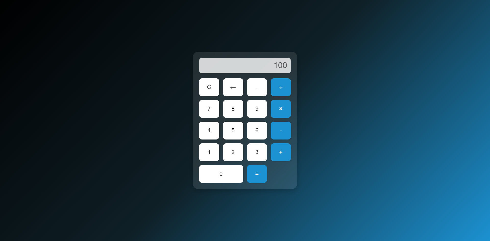

# 🧮 Calculadora Responsiva com Tema Noturno Profissional / Responsive Calculator with Professional Dark Theme

[🇧🇷 Versão em Português](#versao-em-portugues) | [🇬🇧 English Version](#english-version)

---

## 🇧🇷 Versão em Português

### 📌 Descrição

Esta é uma **calculadora responsiva e estilizada**, com foco em proporcionar uma **experiência moderna, elegante e funcional** em qualquer dispositivo.  
Seu visual é baseado em **tema noturno com tons neon**, ideal para uso prolongado e com excelente contraste visual.

### 🌐 Acesse o Projeto  
👉 [Clique aqui para visualizar a calculadora online](https://gustavohrdev.github.io/Calculadora-Responsiva-/)

### 🧠 Problema Resolvido

A maioria das calculadoras online tem:
- Interfaces mal adaptadas para mobile;
- Temas escuros com baixa legibilidade;
- Lógica fraca que permite erros como múltiplos pontos, divisão por zero e falhas na digitação.

### ✅ Como Resolvi

- **CSS Grid e unidades responsivas (`clamp()`, `vw`, `vh`)** para adaptar o layout;
- **Tema escuro com gradiente + neon**, garantindo contraste e estilo;
- **Animações suaves** em botões para feedback visual;
- **JavaScript puro com lógica robusta**: evita bugs, trata backspace e divisão por zero;
- Separação em arquivos organizados: `index.html`, `style.css`, `script.js`;
- **Media queries para smartphones pequenos**.

### 🛠 Tecnologias Utilizadas

- HTML5  
- CSS3 (Grid, Variáveis, Unidades responsivas)  
- JavaScript ES6+

### ▶️ Como Usar

1. Abra o `index.html` em um navegador moderno  
2. Clique nos botões numéricos e operadores  
3. Use `C` para limpar tudo e `←` para apagar o último número  
4. A interface se adapta automaticamente ao seu dispositivo

### 📈 Próximos Passos

- Suporte a entrada via teclado físico  
- Histórico de operações  
- Acessibilidade com ARIA e suporte a leitores de tela

### 📫 Contato

- **GitHub:** [github.com/gustavohrdev](https://github.com/gustavohrdev)  
- **LinkedIn:** [linkedin.com/in/gustavohrdev](https://www.linkedin.com/in/gustavohrdev)  
- **WhatsApp:** [+55 43 99644-8129](https://wa.me/5543996448129)  

---

## 🇬🇧 English Version

### 📌 Description

This is a **responsive and stylish calculator**, focused on delivering a **modern, elegant, and functional experience** on any device.  
Its look is based on a **dark theme with neon accents**, ideal for long-term use and high visual contrast.

### 🌐 Live Demo  
👉 [Click here to view the live calculator](https://gustavohrdev.github.io/Calculadora-Responsiva-/)

### 🧠 Problem Solved

Most simple online calculators:
- Aren’t responsive on mobile;
- Have dark themes with poor contrast;
- Contain weak logic allowing bugs like multiple decimals or division by zero.

### ✅ How I Solved It

- Used **CSS Grid + responsive units** like `clamp()`, `vw`, `vh` for layout;
- Created a **dark neon theme** with high contrast;
- Added **smooth button animations** for better user feedback;
- Built robust **pure JavaScript logic** to prevent common bugs;
- Organized files: `index.html`, `style.css`, `script.js`;
- Added **media queries** for very small mobile screens.

### 🛠 Technologies Used

- HTML5  
- CSS3 (Grid, CSS Variables, Responsive Units)  
- JavaScript ES6+

### ▶️ How to Use

1. Open `index.html` in any modern browser  
2. Click number and operator buttons  
3. Use `C` to clear and `←` to delete the last character  
4. The layout auto-adjusts to your screen

### 📈 Next Steps

- Add support for keyboard input  
- Show operation history  
- Improve accessibility (ARIA, screen reader support)

### 📫 Contact

- **GitHub:** [github.com/gustavohrdev](https://github.com/gustavohrdev)  
- **LinkedIn:** [linkedin.com/in/gustavohrdev](https://www.linkedin.com/in/gustavohrdev)  
- **WhatsApp:** [+55 43 99644-8129](https://wa.me/5543996448129)  

---

🧑‍💻 Developed by [Gustavo Honorio Ribeiro](https://www.linkedin.com/in/gustavohrdev/)
